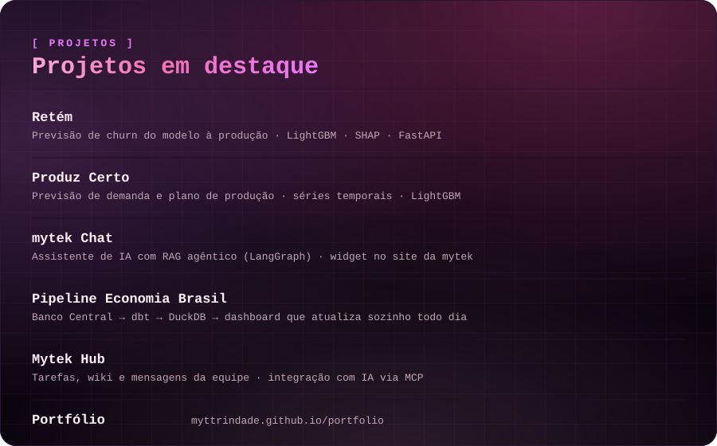

### Maithê Trindade

Analista de Dados, com foco crescente em Machine Learning e Inteligência Artificial.
Transformo dados em dashboards, modelos preditivos e assistentes de IA que apoiam decisões de negócio.

📍 Santos, SP · Baixada Santista &nbsp;·&nbsp; 💻 Projetos remotos em todo o Brasil

 

## Stack

**Análise & BI**
 

**Machine Learning & Data Science**
 

**Inteligência Artificial & Automação**
 

**Engenharia de Dados & Dev**
 

 

 

Disponível para freelance e novas oportunidades em Data Analyst, BI e Machine Learning.

